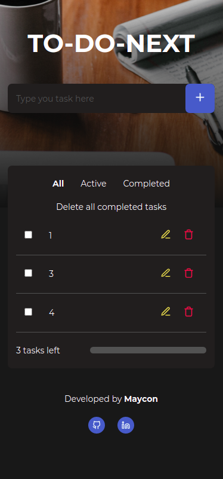
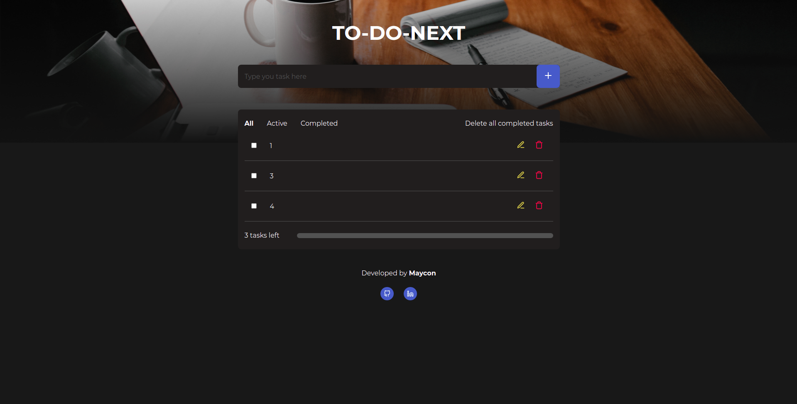

<h4 align="center"> 
	Projeto concluído! 
</h4>
<p align="ledt">TO DO NEXT é uma aplicação que permite o usuário criar, editar e deletar tarefas. Esta aplicação foi criada com o intuito de ampliar as funcionadlidades do projeto desenvolvido no primeiro desafio do Ignite, bootcamp da Rocketseat, consolidandado conhecimentos sobre os conceitos de Estado e Imutabilidade relativos ao uso do ReactJS. Dessa forma, foi realizado um redesign da aplicação além de ser adicionada a resposividade do projeto.</p>

### Tecnologias utilizadas
---

* NextJS
* TypeScript
* Styled Components
* Local Storage

### Features
---

- [x] Criação de tarefa
- [x] Edição de tarefa
- [x] Remoção de tarefa
- [x] Ordenar tarefas concluidas e ativas
- [x] Remoção geral de todas as tarefas concluidas
- [x] Barra de progresso sobre a quantidade de tarefas não concluidas
- [x] Tarefas salvas no localStorage

### Screenshots
---

* Mobile


* Web


### Como instalar
---

```bash
# Clone este repositório
$ git clone https://github.com/mayconrr13/todonext.git

# Instale as dependências
$ yarn 

# Execute a aplicação
$ yarn dev

# Acesse a aplicação
$ http://localhost:3000
```

### Autor
---

<sub><b>Thiago Marinho</b></sub>

Entre em contato!

[](https://www.linkedin.com/in/mayconreisrosario/) 
[](mailto:mayconrr13@gmail.com)
